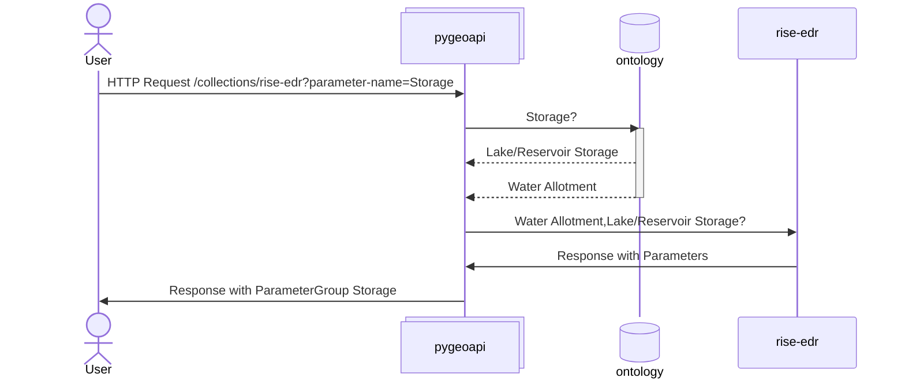

# Internet of Water pygeoapi

This document describes the custom behaviors, features, and enhancements implemented in the Internet of Water (IoW) fork of pygeoapi. This fork extends the core pygeoapi functionality with specialized features for data management and distribution.

### Overview

The Internet of Water pygeoapi fork provides enhanced capabilities for publishing and accessing geospatial data through OGC API standards. This implementation includes additional providers, caching, integrety headers, and an Ontology layet.

## Custom Features and Enhancements

### 1. pygeoapi plugins

The IoW pygeoapi fork ships with [pygeoapi-plugins](https://github.com/cgs-earth/pygeoapi-plugins), 
with additional OGC API Plugin implementations.

#### OGC API - Features

| Provider           | Property Filters/Display | Result Type  | BBox | Datetime | Sort By | Skip Geometry | CQL | Transactions | CRS |
| ------------------ | ------------------------ | ------------ | ---- | -------- | ------- | ------------- | --- | ------------ | --- |
| `CKAN`             | ✅/✅                    | results/hits | ❌   | ❌       | ✅      | ✅            | ❌  | ❌           | ✅  |
| `PsuedoPostgreSQL` | ✅/✅                    | results/hits | ✅   | ✅       | ✅      | ✅            | ✅  | ❌           | ✅  |
| `SPARQL`           | ❌/✅                    | results/hits | ❌   | ❌       | ❌      | ❌            | ❌  | ❌           | ❌  |
| `GeoPandas`        | ✅/✅                    | results/hits | ✅   | ✅       | ✅      | ✅            | ❌  | ✅           | ✅  |

#### OGC API - Tiles

MVT Postgres with optimizations for rendering tiles at low zoom.

| Provider | min_pixel | tile_threshold | disable_at_z | cache_directory | mvt_table | disable_cache_at_z |
| -------- | --------- | -------------- | ------------ | --------------- | --------- | ------------------ |
| MVTPostgreSQLProvider_ | ✅ | ✅ | ✅ | ❌ | ❌ | ❌ |
| MVTPostgresFilesystem  | ✅ | ✅ | ✅ | ✅ | ❌ | ✅ |
| MVTPostgresCache       | ✅ | ✅ | ✅ | ❌ | ✅ | ✅ |

For rendering tiles at low zoom:
- **min_pixel**: Minimum int pixel size for a single feature to render in the tile.
- **tile_threshold**: CQL based filter string for rendering features in the tile.
- **disable_at_z**: Integer controlling what zoom features should stop being filtered

For caching tiles:
- **cache_directory**: File based directory tree to store cached tiles
- **mvt_table**: Postgres table to stored cached tiles
- **disable_cache_at_z**: Integer controlling what zoom tiles should stop being cached

#### OGC API - Processes

| Process | Function |
| ------- | -------- |
| IntersectionProcessor | Query collections by insection of existing geometry file without CQL |
| SitemapProcessor      | Generate Sitemap Index and Sitemap for all API endpoints |

#### SpatioTemporal Asset Catalog

**FileSystemXMLProvider**: Provides a WAF-like STAC directory of a sitemap index and it's associated files. This is used to present a static view of the SiteMapProcessor output.

### 2. Ontology Integration

The IoW pygeoapi fork implements a layer to relate EDR parameters that are conceptually the similar despite different exact syntax or from different systems. This is done by extending the CoverageJSON ParameterGroup contept to dereference queried parameter groups to source specific terminolgy.

In this context, pygeoapi will map queried parameter groups to their source specific parameter key.



This feature adds the `?parameter-name=` query argument the `/collection` and `/collection/{cid}` to allow for filtering of collections containing a specific parameter.

Configuration of the Ontology is optionally done with the following environment variables:

- **PYGEOAPI_ONTOLOGY_GRAPH**: File path to local graph dump.
- **PYGEOAPI_ONTOLOGY_DEFAULT_PREFIX**: IRI to use for the `:` prefix (default: http://lincolninst.edu/cgs/vocabularies/usbr#)
- **PYGEOAPI_ONTOLOGY_CONCEPT_SCHEME**: Top Concept Scheme IRI for the ontology (default: :conceptScheme_8257cf0e)

### 3. Caching

The fork implements various API level caches to further improve performance.

#### Flask Cache

The Flask Cache is configured for the collection landing page and various OGC APIs. Configuration of the Flask Cache can be done with the following environment variables:

- **PYGEOAPI_FLASK_CACHE_TYPE**: Type of cache to initialized (options: `REDIS`, `SIMPLE`, `NULL`)
    - **REDIS_HOST**: Redis host. Required when Redis Cache in use.
    - **REDIS_PORT**: Redis Port. Required when Redis Cache in use.
- **PYGEOAPI_DEFAULT_CACHE_TTL_SECONDS**: Default TTL for cache in seconds.

Setting the environment variables alone will only cause caching on `/collections` and `/collections/{collection_id}`.
To enable caching on collections, per collection cache configuration can be done with the following fields:

```yaml
resources:
    lakes:
        type: collection
        # Inlcuding just the `flask_cache` key will trigger cache with default TTL
        flask_cache:
            # Cache this collection for 360 seconds
            ttl_seconds: 360
            # Remove bbox from blacklist of cache terms.
            # `bbox` and `coords` query args cause the request
            # bypass the cache by default
            permit_args: [bbox]
```
 
### 4. Integrity Header

The fork implements [RFC9530](https://www.rfc-editor.org/rfc/rfc9530.html), adding support for
`Want-Content-Digest` request header. This allows a client to examine if the content of the remote source is new without downloading the content. There is no downstream configuration possible for this plugin. Implemented in https://github.com/internetofwater/pygeoapi/pull/15.

### 5. Other miscellaneous diffs

- Use file modified time in STAC.
- Per resource configuration of `provider-name` to allow filtering by provider at the `/collections` level.